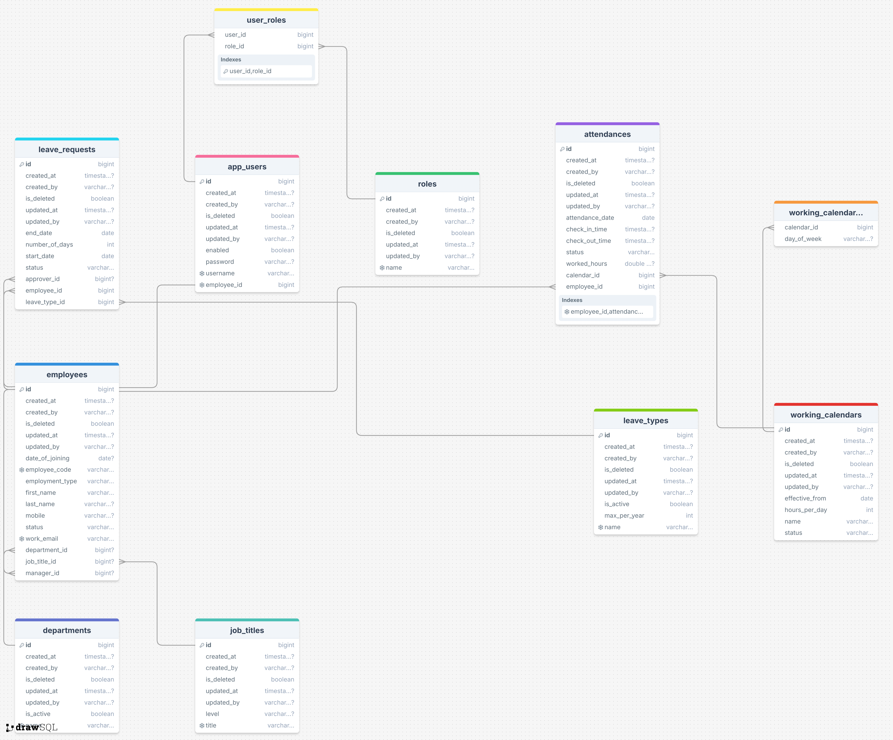

# ERP HRMS Backend

A ERP-style Human Resource Management backend built using Spring Boot.
The system manages employee lifecycle, attendance, leave management, and enforces
role-based and ownership-aware security using JWT.

## Features

- Employee lifecycle management (draft → active → inactive)
- Attendance tracking (check-in / check-out)
- Leave management with approval workflow
- Working calendar configuration
- Role-based access control (HR, Manager, Employee)
- Ownership-aware authorization
- JWT-based authentication
- Centralized exception handling
- Read-optimized HR reports with PDF export

## Architecture

- Monolithic Spring Boot application
- Layered architecture:
    - Controller → DTO → Service → Repository
- Business logic isolated in services
- Security enforced at service layer using `@PreAuthorize`

## Reports

The system provides read-only, secure HR reports designed for operational and managerial use.
All reports enforce role-based and ownership-aware access control and are optimized using
aggregation queries.

### Attendance Reports
- Monthly attendance summary per employee
- Total working days, present days, and worked hours
- Downloadable PDF reports

### Leave Reports
- Annual leave summary per employee
- Approved, rejected, and pending leave counts
- Downloadable PDF leave statements

### Report APIs

#### Attendance
- `GET /api/reports/attendance/monthly`
- `GET /api/reports/attendance/monthly/pdf`

#### Leave
- `GET /api/reports/leaves/summary`
- `GET /api/reports/leaves/summary/pdf`

### Sample Flow: Leave Summary PDF

1. Authenticate using login API and obtain JWT
2. Call leave summary report API
3. Download PDF leave statement

### Report Security

- HR can access reports of reporting employees
- Admin has full access
- Security is enforced at service layer using method-level authorization

## Tech Stack

- Java 17
- Spring Boot
- Spring Security (JWT)
- Spring Data JPA (Hibernate)
- MapStruct
- Lombok
- MySQL
- Maven

## Domain Model

- Employee
    - Department
    - JobTitle
    - Manager (self-referencing)
- User
    - Roles (HR, Manager, Employee)
- Attendance
- LeaveRequest
- LeaveType
- WorkingCalendar

## ER/Table Diagram

## Security Model

- JWT-based stateless authentication
- Role-based authorization:
    - HR: Employee management
    - Manager: Leave approvals
    - Employee: Self-service actions
- Ownership enforcement:
    - Employees can access only their own attendance and leave data
- Method-level authorization using `@PreAuthorize`

## API Overview

### Auth
- `POST /api/auth/login`

## API Overview

### Employee
- `POST /api/employees`
- `PUT /api/employees/{id}/activate`
- `PUT /api/employees/{id}/deactivate`

### Attendance
- `POST /api/attendance/{employeeId}/check-in`
- `POST /api/attendance/{employeeId}/check-out`

### Leave
- `POST /api/leaves/{employeeId}`
- `PUT /api/leaves/{leaveId}/approve`
- `PUT /api/leaves/{leaveId}/reject`

## Sample Flow: Employee Check-in

1. Login
   POST /api/auth/login

2. Receive JWT token

3. Call attendance API
   POST /api/attendance/{employeeId}/check-in
   Authorization: Bearer <JWT>

## Setup & Run

1. Clone repository
2. Configure database in `application.yml`
3. Run:
   mvn clean install
   mvn spring-boot:run

## Test Users

| Role     | Username         | Password |
|----------|------------------|----------|
| HR       | hr@erp.com       | password |
| Manager  | manager@erp.com  | password |
| Employee | employee@erp.com | password |

## Future Enhancements

- Payroll processing
- Advanced reporting dashboards
- Microservices decomposition
